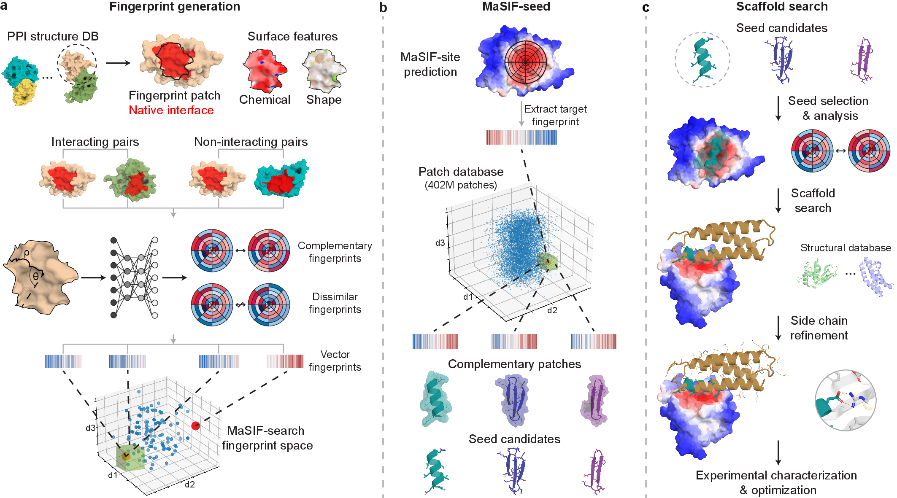

## _MaSIF-seed_ - An enhanced representation of protein structures that enables de novo design of protein interactions

This repository contains code to design de novo binders based on surface fingerprints. The code was used to perform the experiments in: [citation.bib](citation.bib).

[](https://www.biorxiv.org/content/early/2023/01/03/2022.06.16.496402)
[](https://zenodo.org/record/7643697)

## Table of Contents: 

- [Description](#description)
- [Method overview](#Method-overview)
- [System and hardware requirements](#system-and-hardware-requirements)
- [Docker container](#Docker-container)
- [Step-by-step example](#step-by-step-example)
- [Reproducing the benchmarks](#reproducing-the-benchmark)
- [Design of novel protein binders](#Design-of-novel-protein-binders)
- [PyMOL plugin](masif/README.md#pymol-plugin)
- [License](#License)
- [Reference](#Reference)

## Description

Physical interactions between proteins are essential for most biological processes governing life. However, the molecular determinants of such interactions have been challenging to understand, even as genomic, proteomic, and structural data grows. This knowledge gap has been a major obstacle for the comprehensive understanding of cellular protein-protein interaction (PPI) networks and for the de novo design of protein binders that are crucial for synthetic biology and translational applications. We exploit a geometric deep learning framework operating on protein surfaces that generates fingerprints to describe geometric and chemical features critical to drive PPIs. We hypothesized these fingerprints capture the key aspects of molecular recognition that represent a new paradigm in the computational design of novel protein interactions. As a proof-of-principle, we computationally designed several de novo protein binders to engage four protein targets: SARS-CoV-2 spike, PD-1, PD-L1, and CTLA-4. Several designs were experimentally optimized while others were purely generated in silico, reaching nanomolar affinity with structural and mutational characterization showing highly accurate predictions. Overall, our surface-centric approach captures the physical and chemical determinants of molecular recognition, enabling a novel approach for the de novo design of protein interactions and, more broadly, of artificial proteins with function.

## Method overview




## System and hardware requirements

MaSIF-seed has been tested on Linux, and it is recommended to run on an x86-based linux Docker container. It is possible to run on an M1 Apple environment but it runs much more slowly. To reproduce the experiments in the paper, the entire datasets for all proteins consume several terabytes. 

Currently, MaSIF takes a few seconds to preprocess every protein. We find the main bottleneck to be the APBS computation for surface charges, which can likely be optimized. Nevertheless, we recommend a distributed cluster to 
preprocess the data for large datasets of proteins. A GPU is strongly recommended, especially for computing MaSIF-search and MaSIF-site inference, as it can be 60 times faster!

## Docker container

Since MaSIF-seed relies on a few external programs (msms, APBS) and libraries (pyMesh, tensorflow, scipy, open3D), 
we strongly recommend you use the Dockerfile and Docker container. 

```
git clone https://github.com/LPDI-EPFL/masif_seed.git
cd masif_seed
docker build . -t masif_seed 
docker run -it -v $PWD:$PWD masif_seed
```

## Step-by-step example

We will test MaSIF-seed using one example consisting of a single helix (BH3) and a receptor (Bcl-xL):

```
cd masif/data/masif_peptides/
```

First split the BIM BH3, as crystallized in PDB ID: 4QVF, chain B into helices: 

```
./data_extract_helix_one.sh 4QVF_B
```

This example contains exactly one helix, `4QVF000_B`. Now precompute the features for this 
helix, including the geodesic coordinates: 

```
./data_precompute_patches_one.sh 4QVF000_B
```

Finally, compute the MaSIF-site prediction and the MaSIF-search descriptors. 

```
./predict_site.sh 4QVF000_B
./compute_descriptors.sh 4QVF000_B
```

Once the site predictions and descriptors on `4QVF000_B` have been computed, we 
can focus on the target. 

```
cd ../../../
cd masif_seed_search/data/masif_targets/
```

The features, MaSIF-site and MaSIF-search descriptors must be computed as well for the target, 
as well as a surface with per-vertex coloring. 

```
./run_target_protocol.sh 4QVF_A
cd targets/4QVF_A
```

Finally, run the script to match Bcl-xL to all precomputed peptides: 

```
./run.sh 4QVF_A
```

## Configuring parameters

There are some parameters that may improve your search in 'params_peptides.py':

The main criteria for speed is the 'descriptor distance cutoff'. This cutoff determines which fingerprints are further considered and which are completely discarded. The lower the value, the faster the search (and the higher the number of false negatives):
```
# Score cutoffs -- these are empirical values, if they are too loose, then you get a lot of results.
# Descriptor distance cutoff for the patch. All scores below this value are accepted for further processing.
params['desc_dist_cutoff'] = 1.7 # Recommended values: [1.5-2.0] (lower is stricter)
```

Another important cutoff value is the interface cutoff. All patches are scored due to their interface propensity. One can assume that during the search we want to find peptides with a high interface cutoff. You can lower this value to increase the number of candidates:

```
# Interface cutoff value, all patches with a score below this value are discarded.
params['iface_cutoff'] = 0.75 # Recommended values: [0.75-0.95] range (higher is stricter)
```

Finally, an important value is the neural network score cutoff. This neural network cutoff is the second stage ranking. The lower the value, the more candidates are output. In practical terms, a value above 0.8 is good:

```
# Neural network score cutoff - Discard anything below this score
params['nn_score_cutoff'] = 0.8 # Recommended values: [0.8-0.95] (higher is stricter)
```

The number of sites to target in the protein (generally one should be fine):

```
# Number of sites to target in the protein
params['num_sites'] = 1
```

## Clustering helical peptides. 

The distribution provides a few scripts to cluster helical results in a specific site. To do this I recommend reducing strictness of the desc_dist_cutoff and nn_score_cutoff parameters to increase the number of results, for example to the following values: 
```
params['desc_dist_cutoff'] = 2.5
params['nn_score_cutoff'] = 0.90
```

The following files are in your target directory and can be used for clustering: 
```
align_all_to_all_fixed_length.slurm 
align_all_to_all_setup.sh
MDS_HELICES_RMSD.ipynb
```

Run them in the following order: 

```
./align_all_to_all_setup.sh
sbatch align_all_to_all_fixed_length.slurm 
```

Once the batch job finishes, the data can be plotted in the MDS_HELICES_RMSD.ipynb jupyter notebook. 

## Dealing with the speed of precomputation and other resources - features in experimental mode.

Computing MaSIF-search fingerprints is around 60x faster with a GPU vs. a CPU.

Currently, the slowest step in MaSIF-seed is the precomputation of features. A branch is available in this repository that is signficantly faster in precomputations, bringing down the computation for a large protein from a minute or two to a few seconds. You are welcome to experiment with this version. The main changes to the fast version are in the replacement of multi-dimensional scaling for patch radial coordinates (the slowest step in precomputation) with radial coordinates computed directly with Dijkstra.

MaSIF-seed uses a large amount of temporary storage for the patch decomposition, but most of it is not necessary to keep after computing fingerprints. 


## Design of novel protein binders

To apply MaSIF-seed to the design of PPIs, we provide an example [Jupyter notebook](scripts/masif_seed_pdl1.ipynb) 
that demonstrates how to design a binder gainst PD-L1 using non-helical fragments. A description of the Rosetta scripts used during design can be found [here](rosetta_scripts/README.md).


## License

MaSIF-seed is released under an [Apache v2.0 license](LICENSE).

## Reference
If you use this code, please use the bibtex entry in [citation.bib](citation.bib)

